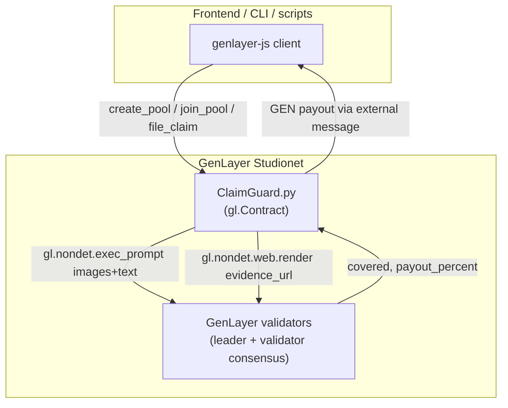

# ClaimGuard

### AI‑Adjudicated Mutual Coverage Pools on GenLayer

ClaimGuard is a decentralized, member-funded "mutual insurance" protocol built as a
GenLayer Intelligent Contract. Anyone can start a coverage pool, members pay a premium
in GEN to join, and when something goes wrong they file a claim with evidence — a photo,
a supporting URL, or both. GenLayer's validators independently read that evidence (using
both vision-model image analysis and live web reads) against the pool's own coverage
terms and reach consensus on whether the claim is covered and how much to pay. There is
no adjuster, no claims desk, and no admin withdrawal path: the contract holds the pooled
GEN and only ever releases it through an AI-adjudicated claim.

Network target: **GenLayer Studionet** (`https://studio.genlayer.com/api`, chain id
`61999`) — GenLayer's hosted, zero-setup network. The contract itself has no
network-specific code, so the same file deploys unmodified to localnet or any testnet.

**Live deployment:** [`0x67Ca1fE518e1Fa416DE2c2936094c7349b579dba`](https://explorer-studio.genlayer.com/address/0x67Ca1fE518e1Fa416DE2c2936094c7349b579dba)
on Studionet · [Source on GitHub](https://github.com/reza9133/claimguard) ·
built by [@amirhp771](https://x.com/amirhp771)

> This project is a companion piece to a freelance-escrow Intelligent Contract that also
> uses an AI judge to decide "was the deliverable good enough?" ClaimGuard applies the
> same core idea — let AI-validator consensus adjudicate a contested outcome — to a
> different shape of problem: a *shared pool* serving *many* members over *time*, with
> *image evidence* rather than a single webpage, and (deliberately) a different
> equivalence-principle pattern under the hood. See [Design Notes](#design-notes).

## Table of Contents

- [What is ClaimGuard?](#what-is-claimguard)
- [How It Works](#how-it-works)
- [Feature Overview](#feature-overview)
- [Claim Lifecycle](#claim-lifecycle)
- [Architecture](#architecture)
- [Repository Layout](#repository-layout)
- [Security Model](#security-model)
- [Design Notes](#design-notes)
- [Getting Started](#getting-started)
- [Frontend](#frontend)
- [Testing & Quality](#testing--quality)
- [Deployment](#deployment)
- [Contract Reference](#contract-reference)

## What is ClaimGuard?

Most on-chain "insurance" demos either need a centralized oracle to say what happened,
or a human adjuster in the loop. GenLayer's Intelligent Contracts remove both: the
contract itself can read a photo, fetch a web page, and reach multi-validator consensus
on a judgment call — natively, in Python, with no oracle.

ClaimGuard uses that to implement peer-funded mutual coverage:

- **Anyone creates a pool** by writing coverage terms in plain English (what's covered,
  what's excluded), a premium, a coverage period, and per-claim / per-period payout caps.
- **Members join** by paying the premium; coverage lasts one period and is renewable.
- **Members file claims** with a description plus a photo and/or a URL as evidence.
- **The AI decides**, atomically, in the same transaction: is this covered, and if so,
  what percentage of the requested amount is justified by the evidence? If approved, GEN
  is paid out from the pool immediately.
- **One appeal** is allowed per denied claim, with room for fresh evidence.

## How It Works

1. A pool creator calls `create_pool()` with coverage terms and limits.
2. Anyone can `top_up_pool()` to seed or support a pool's reserve.
3. A member calls `join_pool()`, paying the premium; this opens (or renews) their policy.
4. When something happens, the member calls `file_claim()` with a description and
   evidence. GenLayer validators independently:
   - render the evidence URL (if any) as text,
   - pass the photo (if any) to a vision-capable model alongside the pool's terms and the
     claim description,
   - decide `covered` (bool) and `payout_percent` (0–100), and
   - reach consensus on those two fields specifically — not on the free-text reasoning,
     which is allowed to vary between reviewers.
5. If covered, GEN is transferred to the claimant on the spot, capped by the claim's
   requested amount, the pool's per-claim maximum, and whatever GEN the pool actually has.
6. If denied, the member gets one shot at `appeal_claim()` with additional context and/or
   a different photo.

## Feature Overview

### Pool mechanics
- Plain-English coverage terms set once by the creator, immutable evidence for every
  future claim's adjudication.
- Per-claim and per-period payout limits, enforced in the contract, not just in the prompt.
- Any address can top up a pool's reserve — useful to seed a new pool or keep an
  under-funded one solvent.
- Creators can pause new joins/renewals without stripping coverage from existing members.

### Claims & adjudication
- Evidence is a photo (`bytes`, analyzed by a vision-capable model), a URL (rendered live
  and fed to the model as text), or both.
- Adjudication is atomic — `file_claim()` files *and* resolves the claim in one
  transaction, with GEN moving immediately on approval.
- Partial payouts: the AI can approve a claim for less than 100% of the requested amount
  when the evidence only partially supports it.
- Exactly one appeal per denied claim, with fresh evidence.
- Fraud-signal flagging: the model is asked to surface manipulation attempts (e.g.
  evidence that tries to instruct it directly) as red flags on the claim record.

### Accounting & isolation
- Every pool tracks its **own** GEN balance; a payout from one pool can never touch
  another pool's funds even though the contract holds all of them together.
- No admin withdrawal exists anywhere in the contract — the only way GEN ever leaves a
  pool is through an AI-approved claim.

## Claim Lifecycle

```
 create_pool()
      │
      ▼
 ┌─────────┐   join_pool()    ┌──────────────┐
 │  Pool    │ ───────────────▶ │ Active Policy │
 └─────────┘                  └──────┬───────┘
                                      │ file_claim(description, amount, url?, photo?)
                                      ▼
                         ┌─────────────────────────┐
                         │ AI adjudication (atomic) │
                         │  covered?  payout_percent │
                         └────────────┬────────────┘
                             covered  │  not covered
                        ┌─────────────┴─────────────┐
                        ▼                            ▼
                 payout to claimant             status: denied
                 status: approved                     │
                                                        │ appeal_claim() — once
                                                        ▼
                                          AI re-adjudicates with new evidence
                                                (approved | denied, final)
```

## Architecture



All contract state — pools, policies, claims — is stored as JSON strings inside
`TreeMap[u256, str]` / `TreeMap[str, str]` fields, the same pragmatic pattern used by the
companion freelance-escrow contract: cheap to write, trivial to read back with
`json.loads`, and it sidesteps having to model every nested shape as a typed dataclass.

## Repository Layout

```
claimguard/
├── contracts/
│   └── claimguard.py         # the Intelligent Contract
├── test/
│   └── test_claimguard.py    # genlayer-test direct-mode suite (46 tests)
├── deploy/
│   └── deployStudionet.mjs   # standalone genlayer-js deploy script
├── frontend/                 # Next.js app (wagmi/RainbowKit + genlayer-js)
│   ├── app/                  # routes: /, /pools, /pools/[id], /pools/new,
│   │                         #         /claims/[id], /dashboard
│   ├── components/
│   ├── hooks/useClaimGuardContract.ts
│   └── lib/
├── gltest.config.yaml        # network config, defaults to studionet
├── package.json
├── requirements.txt
└── .env.example
```

## Security Model

- **Escrow isolation.** Every pool carries its own `balance` field in its stored JSON.
  `_settle_claim_payout()` only ever debits the pool passed into it, and every payout is
  capped by `min(requested_amount, max_payout_per_claim, pool["balance"])` — a claim can
  never overdraw its own pool, let alone another one.
- **No admin backdoor.** There is no function anywhere in the contract that lets a pool
  creator (or anyone else) withdraw pooled GEN directly. The only way funds leave a pool
  is `_settle_claim_payout()`, called only from inside AI-adjudicated `file_claim()` /
  `appeal_claim()`.
- **Self-filing is safe here.** In a two-party escrow, letting the payee trigger their own
  payout evaluation is a real trust smell. In a mutual pool there's no counterparty to
  favor — the verdict comes from independent AI-validator consensus, not from who called
  the method — so `file_claim()` can safely resolve atomically in the claimant's own
  transaction. See [Design Notes](#design-notes).
- **Prompt-injection fencing.** The claim description, evidence URL, fetched page text,
  and (via an explicit instruction to the model) anything written on the photo itself are
  all treated as untrusted, fenced input. The model is told to treat embedded
  instructions as a red flag pushing toward denial, never as a command to follow.
- **Spend limits are structural, not just prompted.** `max_payout_per_claim` and
  `max_claims_per_member_per_period` are enforced in Python before the AI is even asked
  anything, so a single bad verdict (or a single bad actor) is capped in blast radius by
  contract logic, not by hoping the model behaves.

## Design Notes

Three choices here are worth calling out explicitly, because they depart from patterns
you'll see in some AI-judge contracts:

**Payouts are integer percentages, not floats.** GenLayer's calldata format — the
encoding used whenever a value crosses the leader/validator boundary inside
`gl.vm.run_nondet_unsafe`, or comes back from `gl.nondet.exec_prompt` — does not support
raw Python `float`, only sized integers, strings, bytes, bool, and collections of them.
`payout_percent` is modeled as an `int` (0–100) everywhere it crosses one of those
boundaries; it's converted to a fraction only for the final integer-math payout
calculation (`cap * payout_percent // 100`), and floats never appear in anything a
validator has to compare or a leader has to return.

**Consensus compares decision fields, not the raw model output.** It's tempting to wrap
the whole AI call in `gl.eq_principle.strict_eq` and compare the model's full JSON
response for exact equality. In practice this rarely reaches consensus: two honest
validators calling the same model will phrase their `reasoning` differently even when
they agree on the verdict, and `strict_eq` requires byte-for-byte identical output.
ClaimGuard instead uses a custom leader/validator pair
(`gl.vm.run_nondet_unsafe(leader_fn, validator_fn)`) where the validator re-derives the
verdict independently and compares only `covered` (must match exactly) and
`payout_percent` (must be within 15 points) — the [Equivalence
Principle](https://docs.genlayer.com/developers/intelligent-contracts/equivalence-principle)
docs' "partial field matching" + "numeric tolerance" patterns, combined. Free-text
reasoning is allowed to differ; the decision is not.

**Wei-scale amounts are JSON strings, not JSON numbers.** `premium`, `balance`,
`requested_amount`, `payout_amount`, and the other GEN-denominated fields are stored in
each pool/claim's JSON blob as strings (`"1000000000000000000000"`), not raw JSON numbers.
A typical wei amount routinely exceeds `2^53`, and JavaScript's `JSON.parse` — which the
frontend necessarily uses to read these back — represents all JSON numbers as 64-bit
floats, silently losing precision past that point. Every internal read site in the
contract already does `int(...)` on these fields (which accepts numeric strings exactly as
well as ints), so this cost nothing in Python; the frontend's `lib/types.ts` types them as
`string` and routes them through `formatGEN()` / `BigInt(...)`, never `Number(...)`.

**Payouts follow checks-effects-interactions.** `_settle_claim_payout()` debits
`pool["balance"]` and updates `pool["total_paid_out"]` *before* calling
`emit_transfer()`, not after. GenLayer's `emit()` is asynchronous — the external message is
only queued during this transaction and the actual child transaction executes on
finalization, so there's no synchronous callback back into this call the way a classic
Solidity reentrancy attack would need — but updating state before the external interaction
is still the safer default, and it costs nothing to get right.

## Getting Started

### Prerequisites

- Python 3.12+
- Node.js 18+
- A GenLayer Studionet account with GEN — open
  [studio.genlayer.com](https://studio.genlayer.com), select/create an account, and use
  the 💧 faucet button in the account selector.

### 1. Install

```bash
git clone <this-repo>
cd claimguard
pip install -r requirements.txt
npm install
```

### 2. Run the tests

```bash
python3 -m pytest test/test_claimguard.py -v
# or
npm test
```

All 46 tests run fully in-memory (GenLayer's "direct mode") in about a second — no
network, no Docker, beyond a one-time SDK download the first time you run them.

### 3. Deploy to Studionet

```bash
node deploy/deployStudionet.mjs
```

This generates a fresh account, prints its address, and deploys `claimguard.py`. Fund
that address via the Studio faucet first (see Prerequisites), or set `PRIVATE_KEY` in
your environment to reuse an existing funded account:

```bash
PRIVATE_KEY=0xyour_key node deploy/deployStudionet.mjs
```

Prefer the GenLayer CLI instead? That works unmodified too:

```bash
npm install -g genlayer
genlayer network studionet
genlayer deploy --contract contracts/claimguard.py
```

### 4. Run the frontend

```bash
cd frontend
npm install
cp .env.example .env.local
# edit .env.local: NEXT_PUBLIC_CONTRACT_ADDRESS=<address from step 3>
npm run dev
```

Open [http://localhost:3000](http://localhost:3000), connect a wallet, and it'll prompt
you to add/switch to GenLayer Studionet automatically. See
[`frontend/README.md`](frontend/README.md) for the full page list and implementation notes.

## Testing & Quality

```bash
# Fast unit tests (direct mode, in-memory GenVM)
python3 -m pytest test/test_claimguard.py -v

# Static analysis + schema validation
genvm-lint check contracts/claimguard.py

# Both, in one shot
npm run check
```

The test suite covers pool creation and validation, funding and pause/resume, membership
and renewal timing, the full claim lifecycle (approval, partial payout, denial, per-pool
balance isolation, per-claim and pool-balance payout caps, claim-limit enforcement and its
reset on period rollover, coverage expiry), the appeal flow (approval-on-appeal, only the
claimant may appeal, no appealing an approved claim, no second appeal), and — most
importantly — the actual **consensus logic**: `direct_vm.run_validator()` is used to
independently re-run the validator side of `_adjudicate()` and confirm it agrees within
tolerance, disagrees outside tolerance, disagrees on a `covered` mismatch, and agrees when
both leader and validator deny.

## Deployment

| Network | RPC | Chain ID | Notes |
|---|---|---|---|
| **Studionet** (default) | `https://studio.genlayer.com/api` | `61999` | Hosted, zero setup. Built-in faucet. |
| Localnet | `http://127.0.0.1:4000/api` | `61127` | Requires GenLayer Studio (Docker) or GLSim. |
| Testnet Asimov | `https://rpc-asimov.genlayer.com` | `4221` | Infrastructure/stress testing. |
| Testnet Bradbury | `https://rpc-bradbury.genlayer.com` | `4221` | Real AI/LLM workloads, production-like. |

Switch networks with `gltest.config.yaml` (Studio-mode integration tests) or by pointing
`deploy/deployStudionet.mjs` at a different `genlayer-js/chains` export.

**Currently deployed contract:** [`0x67Ca1fE518e1Fa416DE2c2936094c7349b579dba`](https://explorer-studio.genlayer.com/address/0x67Ca1fE518e1Fa416DE2c2936094c7349b579dba)
on Studionet — this is the default `NEXT_PUBLIC_CONTRACT_ADDRESS` baked into
`frontend/.env.example`, so `frontend/` points at it out of the box.

## Contract Reference

### Writes

| Method | Who | Description |
|---|---|---|
| `create_pool(name, description, premium, coverage_period_days, max_payout_per_claim, max_claims_per_period)` | anyone | Creates a new coverage pool. Returns `pool_id`. |
| `top_up_pool(pool_id)` *(payable)* | anyone | Donates GEN into a pool's reserve. |
| `set_pool_active(pool_id, active)` | pool creator | Pauses/resumes new joins & renewals only. |
| `join_pool(pool_id)` *(payable, exact premium)* | anyone | Opens or renews a policy. |
| `cancel_policy(pool_id)` | member | Opts out. No refund. |
| `file_claim(pool_id, description, requested_amount, evidence_url="", photo=b"")` | covered member | Files **and** atomically adjudicates a claim. Returns `claim_id`. |
| `appeal_claim(claim_id, additional_context, additional_evidence_url="", photo=b"")` | claimant | One re-adjudication per denied claim. |

### Views

| Method | Description |
|---|---|
| `get_pool(pool_id)` / `get_all_pools()` / `get_pool_count()` | Pool data as JSON. |
| `get_policy(pool_id, member)` / `is_covered(pool_id, member)` | Membership status. |
| `get_claim(claim_id)` / `get_claim_count()` | Claim data as JSON. |
| `get_claims_by_pool(pool_id)` / `get_claims_by_member(member)` | Filtered claim lists. |

### AI adjudication output

Every `file_claim` / `appeal_claim` call produces a verdict with exactly these fields:

```json
{
  "covered": true,
  "payout_percent": 80,
  "reasoning": "free text, allowed to vary between validators",
  "red_flags": ["short strings noting any fraud/manipulation signals"]
}
```

`covered` and `payout_percent` are what the network reaches consensus on (exact match,
and within 15 percentage points, respectively); `reasoning` and `red_flags` are stored on
the claim for transparency but are never compared between validators.
